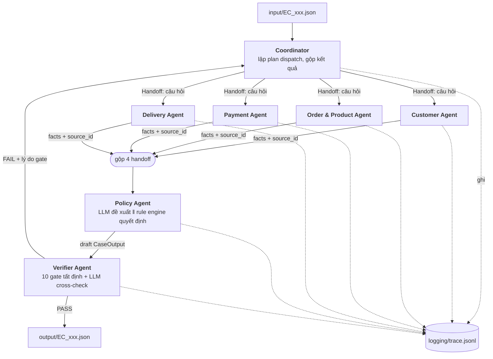

# Kiến trúc hệ thống Multi-Agent — K4 Day 09

> Hệ thống điều tra 50 khiếu nại thương mại điện tử Olist, áp dụng `EC_POLICY_V2`.
> Nguyên tắc xuyên suốt: **fact đến từ dữ liệu, không đến từ suy đoán của model.**

---

## 1. Nguyên tắc thiết kế

Bài toán có một đặc điểm quyết định toàn bộ kiến trúc: `EC_POLICY_V2` là một **bảng quyết định tất định**, và mọi con số trong output đều tính được bằng công thức đóng từ 9 file CSV. Việc chấm điểm so khớp **giá trị field chính xác**.

Do đó hệ thống tách bạch hai loại trách nhiệm:

| Loại | Do ai đảm nhiệm | Lý do |
|---|---|---|
| **Fact & số học** (timestamp, variance giờ, tiền, ID) | Tool tất định trên `DataStore` | Sai số thập phân hoặc ID bịa = mất điểm cứng. LLM không bao giờ được tự tính. |
| **Điều phối, diễn giải, kiểm chứng chéo** | LLM ≤10B trong từng agent | Đây là nơi agent thực sự tạo giá trị: chọn cần tra gì, phát hiện fact thiếu/mâu thuẫn, đề xuất bước tiếp theo. |

Hệ quả: agent **không phải là prompt được đặt tên**. Mỗi agent là một đơn vị có **quyền truy cập dữ liệu riêng**, **bộ tool riêng**, và chỉ giao tiếp với phần còn lại qua **handoff có cấu trúc**. Policy Agent không hề đọc CSV — nó chỉ thấy những gì các agent chuyên trách bàn giao. Đó là điều buộc luồng evidence phải đi qua handoff thay vì đi tắt.

---

## 2. Sơ đồ agent



Vòng phản hồi `Verifier → Coordinator` là thật: khi một gate fail, Coordinator nhận lý do cụ thể, dispatch lại đúng agent liên quan (tối đa 2 lần), và **mọi lượt đều được ghi trace**. Đây là cơ chế "sửa nguyên nhân", không phải sửa tay kết quả.

---

## 3. Vai trò và quyền truy cập dữ liệu

Quyền truy cập được **cưỡng chế ở tầng code**: mỗi agent nhận một `ScopedDataStore` chỉ expose đúng các tool được phép. Agent không có cách nào chạm tới CSV ngoài scope của mình.

| Agent | Trách nhiệm quyết định | CSV được đọc | Tool được cấp |
|---|---|---|---|
| **Coordinator** | Lập plan theo `investigation_scope`, dispatch, gộp, xử lý retry | *(không có)* | `dispatch`, `collect` |
| **Customer** | Danh tính khách + lịch sử mua | `customers`, `orders`(order_id, customer_id) | `resolve_customer`, `list_related_orders` |
| **Order & Product** | Order, item, seller, product, category | `orders`, `order_items`, `products`, `sellers`, `category_translation` | `get_order`, `list_items`, `list_sellers`, `list_products_categories` |
| **Payment** | Tổng payment, đối soát với item + freight | `order_payments`, `order_items`(price, freight_value) | `list_payments`, `reconcile` |
| **Delivery** | Variance giao hàng và handoff từng seller | `orders`(timestamps), `order_items`(shipping_limit_date, seller_id) | `delivery_variance`, `seller_handoff_analysis` |
| **Policy** | Áp `EC_POLICY_V2`: taxonomy, responsibility, refund, actions | *(không có — chỉ nhận handoff)* | `policy_engine.decide` |
| **Verifier** | Chặn output sai trước khi ghi file | read-only toàn bộ, **chỉ để kiểm tra ID có tồn tại** | `id_exists`, `run_gates` |

Ba quyết định đáng chú ý:

- **Coordinator và Policy không đọc CSV.** Nếu chúng đọc được, cả kiến trúc sụp về một script tập trung và handoff trở thành trang trí.
- **Payment Agent thấy `price`/`freight_value` nhưng không thấy `product_id`, `seller_id`.** Nó đối soát tiền, không kết luận về seller.
- **Verifier có quyền đọc rộng nhất nhưng hẹp nhất về mục đích** — chỉ để trả lời "ID này có thật không", không để tính lại nghiệp vụ.

---

## 4. Luồng handoff

### 4.1 Cấu trúc bắt buộc

Mọi handoff đều là một object cùng schema, đáp ứng đúng 4 thành phần đề bài yêu cầu:

```python
class Fact(BaseModel):
    key: str            # "delivery_variance_hours"
    value: Any          # 87.39
    source_id: str      # "order:e481f51cbdc54678b7cc49136f2d6af7"

class Handoff(BaseModel):
    case_id: str                        # (1) ticket ID
    question: str                       # (1) câu hỏi cần trả lời
    from_agent: str
    to_agent: str
    facts: list[Fact]                   # (2) fact + ID nguồn
    missing_or_conflicting: list[str]   # (3) fact thiếu / mâu thuẫn
    suggested_next: str                 # (4) đề xuất cho agent nhận
    ts: str
```

Ràng buộc bất biến: **mọi `Fact` phải có `source_id` dựng được từ CSV**. Fact không có nguồn bị Verifier loại; nó không bao giờ đi vào `evidence_ids`.

Định dạng evidence ID hợp lệ:

```text
order:<order_id>
item:<order_id>:<order_item_id>
payment:<order_id>:<payment_sequential>
seller:<seller_id>
policy:<root_cause_code>
```

### 4.2 Trình tự một case

| # | Từ → Đến | Nội dung |
|---|---|---|
| 1 | Coordinator → 4 specialist | `claimed_order_id` + câu hỏi riêng cho từng domain. Fan-out song song. |
| 2 | Specialist → Coordinator | Facts kèm `source_id`; ghi rõ cái gì thiếu (vd. `order_delivered_customer_date` null). |
| 3 | Coordinator → Policy | Gộp 4 handoff thành một evidence bundle duy nhất. |
| 4 | Policy → Verifier | Draft `CaseOutput` + `ranked_causes` + `evidence_ids`. |
| 5a | Verifier → file | PASS: ghi `output/EC_xxx.json`. |
| 5b | Verifier → Coordinator | FAIL: mã gate + mô tả → retry có mục tiêu (≤2 lần). |

Mỗi bước append một dòng vào `logging/trace.jsonl`. File được **ghi mới mỗi lượt chạy** (không append qua các lần chạy), đúng yêu cầu "chỉ cần lượt chạy mới nhất".

---

## 5. Policy Agent: "LLM đề xuất, rule engine quyết định"

Đây là agent rủi ro nhất — một sai sót ở đây hỏng toàn bộ 50 case. Thiết kế chạy **hai nhánh song song trên cùng bộ evidence**:

```text
evidence bundle
   ├──► LLM  ─────────────────────► primary_issue đề xuất + lý do
   └──► policy_engine.decide() ───► primary_issue quyết định   ◄── nguồn chân lý
                                       │
                         so khớp ──────┤
                                       ├─ khớp  → confidence cao
                                       └─ lệch  → rule engine THẮNG,
                                                  ghi discrepancy vào trace
```

Rule engine luôn thắng, nên độ chính xác không phụ thuộc LLM. Nhưng LLM vẫn đóng góp thật: nó tạo một phán đoán độc lập, và **tỉ lệ bất đồng giữa hai nhánh là một metric kiểm chứng được** — vừa để báo cáo, vừa để phát hiện case mà evidence bundle bị thiếu thông tin.

Nó cũng giải quyết luôn field `confidence` (đề bài không cho công thức) bằng một hàm tất định, giải thích được:

```python
confidence = 1.00
  - 0.15  nếu LLM đề xuất ≠ rule engine
  - 0.10  nếu thiếu order_delivered_customer_date
  - 0.05  nếu reconciled == False
  - 0.05  nếu order không có item row
  - 0.05  nếu phải cắt bớt array do vượt limit
→ clamp về [0.50, 0.99]
```

### Thứ tự áp policy (khớp đầu tiên là dừng)

```text
1. canceled_order_paid      status=canceled     & Σpayment>0  → platform   | refund=Σpayment | issue_full_refund
2. unavailable_order_paid   status=unavailable  & Σpayment>0  → platform   | refund=Σpayment | issue_full_refund
3. late_delivery_seller     giao trễ & carrier nhận sau ≥1 shipping_limit → seller(s)  | refund=Σfreight | refund_freight
4. late_delivery_logistics  giao trễ & không seller nào trễ   → logistics  | refund=Σfreight | refund_freight
5. valid_split_payment      ≥2 payment row & |difference|≤0.10 → không ai  | refund=0        | explain_valid_split_payment
6. unsupported_late_claim   giao đúng hạn & payment khớp      → không ai   | refund=0        | reject_late_refund
```

---

## 6. Verifier Agent: 10 gate tất định

Chạy trước khi bất kỳ file nào được ghi. Gate fail ⇒ không ghi file, trả lý do về Coordinator.

| # | Gate | Kiểm tra |
|---|---|---|
| 1 | Schema | Đủ key bắt buộc, đúng kiểu |
| 2 | Evidence format | Khớp regex của 5 dạng ID |
| 3 | Evidence tồn tại | Mọi `order_id`/`item`/`payment`/`seller` có thật trong CSV |
| 4 | Array limit | 5 order · 5 item · 3 seller · 5 payment · 5 related · 5 product · 5 category · 3 cause · 3 party · 20 evidence · 5 action |
| 5 | Null handling | Order không item ⇒ `expected_total_brl`/`difference_brl`/`reconciled` = `null`, mảng liên quan = `[]` |
| 6 | Làm tròn | Mọi số tiền và số giờ đúng 2 chữ số thập phân |
| 7 | Timestamp | `YYYY-MM-DD HH:MM:SS` hoặc `null` |
| 8 | Nhất quán status | `refund > 0 ⇔ action_required` |
| 9 | Thứ tự action | Action chính đứng đầu; không có `verify_payment_allocation` khi primary là `valid_split_payment` |
| 10 | Thứ tự secondary | multi_item → multi_seller → split_payment → repeat_customer → multiple_categories |

Sau 10 gate, LLM Verifier đọc lại evidence bundle và output để soát tính nhất quán ngữ nghĩa. Cảnh báo của nó được ghi trace nhưng **không tự ý sửa số**.

---

## 7. Phân bổ model

Ràng buộc đề bài: mỗi agent dùng model **≤10B tham số** — giới hạn theo **từng model**, không cộng dồn. Tên model khai báo cứng trong `pipeline.py` (không đặt trong `.env`) theo §9.4 của đề, và ghi lại vào `logging/metadata.json`.

Hệ thống có một `MODEL_REGISTRY` duy nhất ở đầu `pipeline.py`; đổi profile là đổi một dòng.

### Profile A — OpenAI (dùng key sẵn có)

| Agent | Model | Params |
|---|---|---|
| Coordinator, Order & Product, Payment, Delivery, Policy | `gpt-4o-mini` | ~8B *(ước tính)* |
| Customer, Verifier | `gpt-4.1-nano` | không công bố |

> **Lưu ý về con số:** OpenAI **không công bố** số tham số cho model hosted. Con số ~8B của `gpt-4o-mini` là **ước tính** từ Abacha et al., *MEDEC* (Microsoft Research, 12/2024), không phải số liệu chính thức. `metadata.json` phải ghi kèm nguồn ước tính này thay vì trình bày như số liệu xác nhận.

Ưu điểm: không cần tạo tài khoản provider mới giữa buổi thi, rate limit rộng, latency ổn định.
Nhược điểm: không chứng minh được ≤10B; và vì Policy lẫn Verifier cùng một họ model, khả năng kiểm chứng chéo yếu đi (xem ghi chú dưới).

### Profile B — Open-weights (số tham số công khai)

| Agent | Model | Params | Lý do |
|---|---|---|---|
| Coordinator | `qwen/qwen3-8b` | 8.2B | Lập plan + structured output ổn định nhất nhóm <10B |
| Customer | `meta-llama/llama-3.1-8b-instruct` | 8.0B | Việc nhẹ → ưu tiên rẻ và nhanh |
| Order & Product | `qwen/qwen3-8b` | 8.2B | Join nhiều bảng; đa ngữ tốt cho category tiếng Bồ Đào Nha |
| Payment | `qwen/qwen3-8b` | 8.2B | Suy luận số học tốt nhất trong nhóm <10B |
| Delivery | `qwen/qwen3-8b` | 8.2B | So sánh nhiều mốc timestamp |
| Policy | `qwen/qwen3-8b` | 8.2B | Quyết định quan trọng nhất → model mạnh nhất |
| Verifier | `google/gemma-2-9b-it` | 9.2B | **Cố ý khác họ model với Policy** |

Dự phòng khi rate-limit: `mistralai/ministral-8b` (8.0B), `nvidia/nemotron-nano-9b-v2` (9B).

> **Vì sao Verifier phải khác họ model với Policy:** nếu dùng chung model, Verifier sẽ mắc **cùng một loại lỗi** với Policy và cho qua đúng sai lầm cần bắt. Ghép khác họ (Qwen ↔ Gemma) khiến việc kiểm chứng chéo có giá trị thực. Ở Profile A, tính chất này không đạt được — đây là chi phí thật của việc dùng một nhà cung cấp duy nhất.

Cả hai profile đều gọi qua giao diện OpenAI-compatible nên chỉ cần một client duy nhất.

---

## 8. Cấu trúc mã nguồn và artifact

```text
core.py                  # LOI TAT DINH: DataStore · Tools · PolicyEngine · Assembler · Verifier
pipeline.py              # TANG AGENT: MODEL_REGISTRY · Handoff · 7 agent · Tracer · CaseRunner
run.py                   # CLI
architecture.md          # tài liệu này
pipeline.md              # spec thi công chi tiết
individual_<5 số cuối MSSV>_<HoTen>.md
requirements.txt
.env.example             # mẫu; .env thật KHÔNG commit
.gitignore
logging/trace.jsonl      # ghi mới mỗi lượt chạy 50 case
logging/metadata.json    # model, parameter size, framework, runtime
output/EC_001.json … EC_050.json
```

Tách `core.py` khỏi `pipeline.py` là có chủ đích: phần **không được phép sai** nằm gọn một chỗ, không phụ thuộc LLM, không phụ thuộc mạng, và kiểm thử được độc lập. Tầng agent có thể thay đổi tự do mà không đụng tới nó.

Chạy lại một case đơn lẻ là idempotent: `python run.py --case EC_007` ghi đè đúng file đó. Quy trình xử lý case lỗi là **sửa agent/prompt/rule engine rồi chạy lại**, không sửa tay JSON.

---

## 9. Giả định đã chốt

Đề bài có một số điểm chưa đặc tả hết. Các giả định dưới đây được áp dụng nhất quán cho cả 50 case:

| # | Điểm mơ hồ | Giả định |
|---|---|---|
| 1 | ~~`handoff_variance_hours` khi một seller có nhiều item~~ | **Đã giải quyết bằng dữ liệu, không còn là giả định.** Probe toàn bộ `order_items`: **0 / 100.010** cặp `(order_id, seller_id)` có nhiều hơn một `shipping_limit_date`. Mỗi seller trong một order luôn có đúng một mốc ⇒ hai cách hiểu cho cùng kết quả. Vẫn cài `min()` để phòng vệ. |
| 2 | `category_names` tiếng Bồ hay tiếng Anh | Giữ nguyên `product_category_name` từ CSV (nhất quán với nguyên tắc "thứ tự ổn định theo dữ liệu nguồn") |
| 3 | Điều kiện kích hoạt action phụ | `review_seller_handoff` ⟸ có seller trễ · `review_carrier_delay` ⟸ trễ nhưng không seller nào trễ · `verify_refund_completion` ⟸ refund>0 · `coordinate_multi_seller_case` ⟸ ≥2 seller · `verify_payment_allocation` ⟸ ≥2 payment row **và** primary ≠ `valid_split_payment` |
| 4 | Công thức `confidence` | Hàm tất định ở §5 |
| 5 | `payment_types` | Unique, giữ thứ tự xuất hiện theo `payment_sequential` |
| 6 | Cắt bớt khi vượt limit evidence (20) | Ưu tiên: `order` → `item` → `payment` → `seller` → `policy` |
| 7 | Order chưa từng giao (`delivered_customer_date` = null) | Không thỏa điều kiện "giao trễ" ⇒ rơi vào nhánh mặc định `unsupported_late_claim`; `delivery_variance_hours` = `null` |

---

## 10. Chiến lược kiểm thử trước khi có input

`input/` chỉ được công bố lúc Checkpoint 1 (13h–13h30), sau đó chỉ còn 4 tiếng. Rủi ro lớn nhất không phải là thiết kế sai mà là **code chưa từng chạy thật khi input rơi xuống**. Vì vậy pipeline có chế độ `--selftest`.

### 10.1 Sinh case từ dữ liệu thật

`selftest` quét CSV, chọn `order_id` **có thật** đại diện cho từng nhánh policy và từng edge case, rồi dựng file input đúng định dạng đề bài vào `selftest/input/`. Toàn bộ pipeline chạy end-to-end trên đó.

Phân bố thực đo được trên 99.441 order:

| Nhánh / edge case | Số order tồn tại | Có case test |
|---|---:|:---:|
| `canceled_order_paid` | 622 | ✓ |
| `unavailable_order_paid` | 609 | ✓ |
| `late_delivery_seller` | 2.128 | ✓ |
| `late_delivery_logistics` | 5.698 | ✓ |
| `valid_split_payment` | 2.693 | ✓ |
| `unsupported_late_claim` | 87.691 | ✓ |
| Order **không có item row** | 775 | ✓ null-handling |
| `delivered_customer_date` null | 2.965 | ✓ |
| > 5 item (chạm limit) | 256 | ✓ truncation |
| > 5 payment (chạm limit) | 118 | ✓ truncation |
| > 3 seller (chạm limit) | 5 | ✓ truncation |
| Order không có payment row | 1 | ✓ biên hiếm |

Nhờ vậy cả 10 gate của Verifier và cả 6 nhánh policy đều được chạm **trước** 13h. Khi input thật xuống, việc còn lại chỉ là trỏ đường dẫn và chạy.

### 10.2 Kiểm chứng bằng ví dụ trong đề

Đề cho một ví dụ đầy đủ số liệu ở §6 README. Đây là ground truth duy nhất có sẵn, nên nó được đóng thành unit test cố định:

| Đại lượng | Tính lại | Đề ghi |
|---|---|---|
| `delivery_variance_hours` | `2018-03-31 15:23:33 − 2018-03-28 00:00:00` = 87,3925 | `87.39` ✓ |
| `handoff_variance_hours` | `21:33:51 − 20:31:15` = 1,043333 | `1.04` ✓ |
| refund `late_delivery_seller` | Σfreight = 18,27 | `18.27` ✓ |

Ba phép này khoá chặt quy ước **đơn vị giờ thập phân, làm tròn 2 chữ số, dấu có thể âm**.

### 10.3 Thứ tự ưu tiên khi triển khai

Bám đúng thứ tự này để luôn có một hệ thống chạy được, kể cả khi hết giờ:

1. `DataStore` + `policy_engine` + `Verifier` — phần tất định, quyết định gần như toàn bộ điểm số.
2. `--selftest` — chứng minh phần 1 đúng trên dữ liệu thật.
3. Các agent + handoff + `trace.jsonl` — phần ăn điểm kiến trúc.
4. Chọn và gắn model vào `MODEL_REGISTRY`.
5. `metadata.json`, báo cáo cá nhân, `.gitignore`.
